##                                                                 BAN 5753 Mini-Project 2
##                                         Deposit Opening Classification Problem 

####   Meet the team

  #      Summary
  
  Our goal is categorize customers based on their likelihood of responding “yes” or “no” to a bank’s telephone marketing campaign. The dataset included 41188 observations from May 2008 – November 2010, across 20 different columns. We performed EDA, univariate analysis, bivariate analysis, K-means clustering, and 5 different supervised learning methods on this data to familiarize ourselves with using  MLlib within PySpark.
  
From this analysis, we saw that the Gradient-Boosted Tree performed the best of the five supervised learning methods. We also discovered in the bivariate analysis that the duration of a call is an important factor for determining the outcome. Calls that extend for longer time are more likely to result in a deposit than calls that are shorter.

We begin by importing the necessary libraries, initiating a Spark session, and reading in the data. Here, we can see what the data looks like: 

The first data preprocessing step is to rename all columns that contain a “.”, because this character will cause problems later. We will replace it with an underscore: 
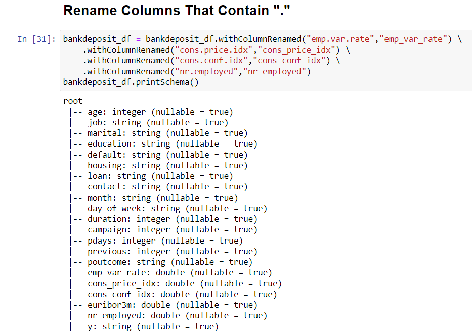

Next, we will encode the Education column into a new integer column. Since levels of education have an implied order, we can provide additional meaning to this column by encoding it into an ordinal variable: 

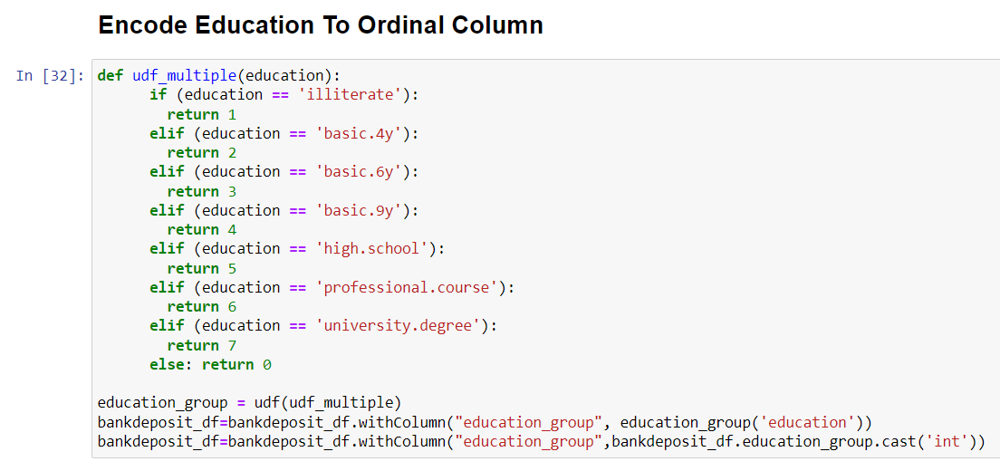

After doing this, we will look at the various columns, based on their data type. First, we will look at the categorical/string columns: 

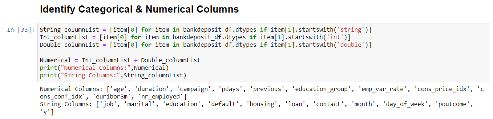

We also will examine the numerical columns and their statistics: 

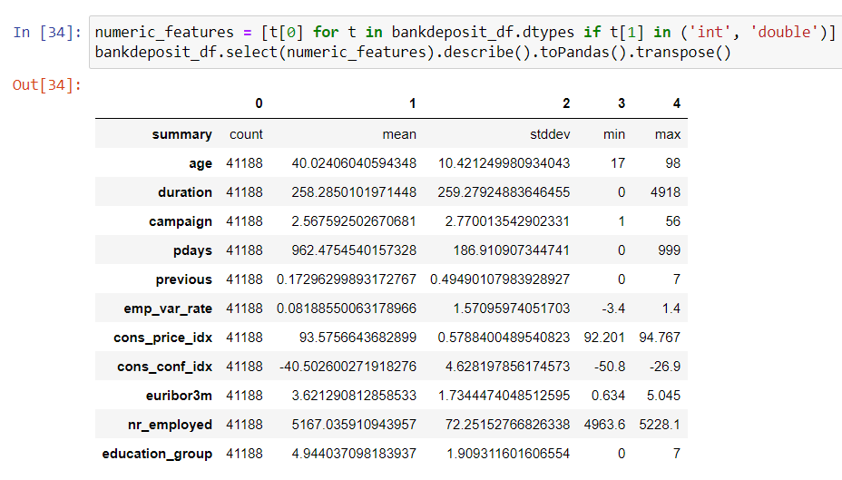
 

After this step, we check for null or missing values in any columns. We can see that there are no null values: 

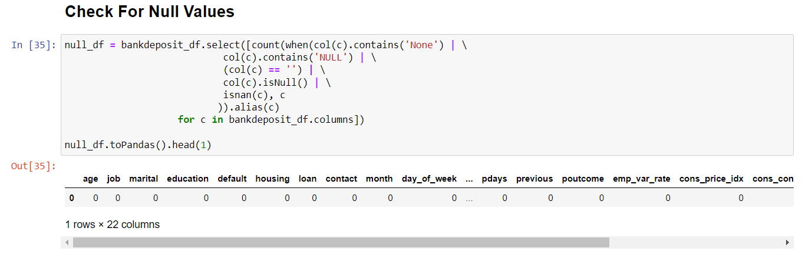

We also can check for imbalance between the two classes in the outcome variable, “y”. We see some class imbalance, so we can adjust for this with oversampling if it becomes and issue when we are training and evaluating our models. 

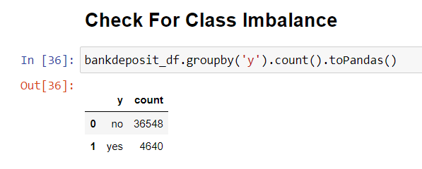

We also can visualize this class imbalance. For many of the visualizations in this report, we will need to convert the PySpark dataframe to Pandas in order to use the Pandas visualization functions, as seen below: 

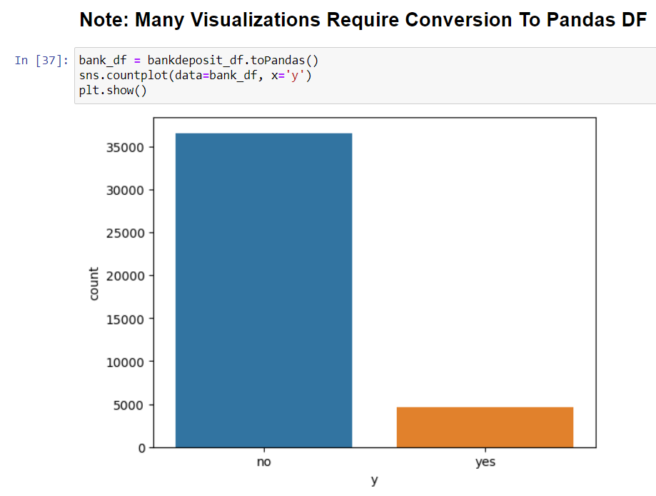

The final step for us to check before we begin more detailed analysis is for correlation between predictor variables. If several predictors are highly correlated, then we can exclude some of them from our analysis without loosing explanation power. Below, our correlation analysis can be seen: 

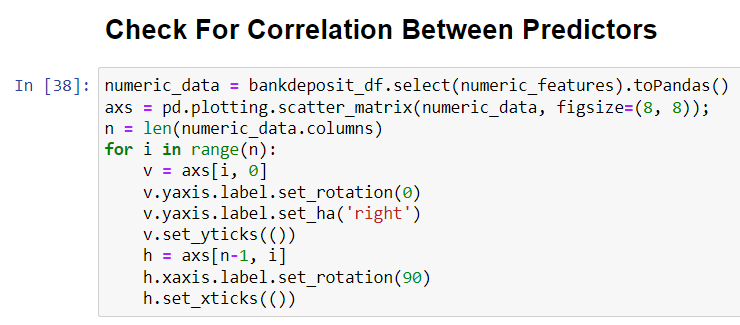

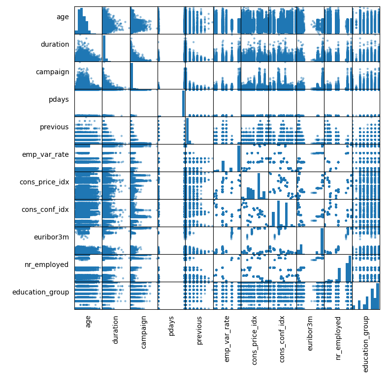

It does not appear that any of our predictor variables are highly correlated with each other, so we can move forward with all the variables included for now. 

We now will perform some univariate analysis. First, we will look at the distributions of the numerical variables: 

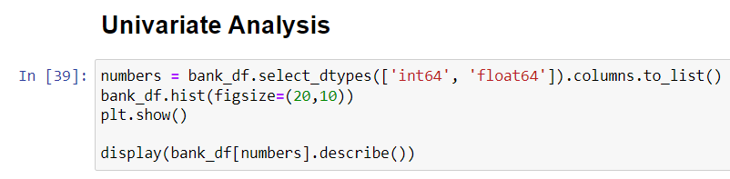

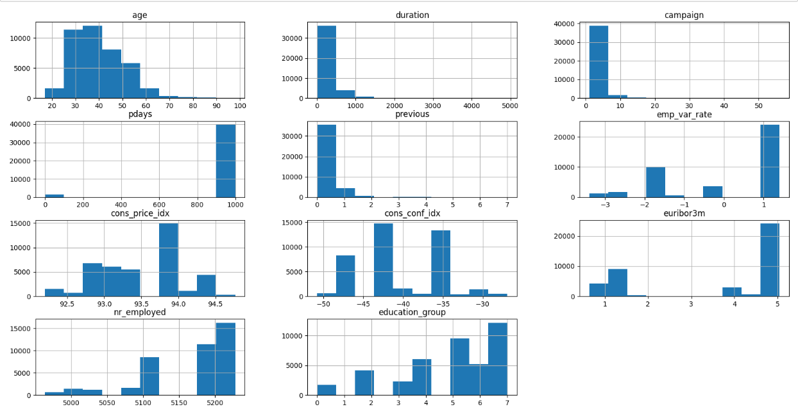

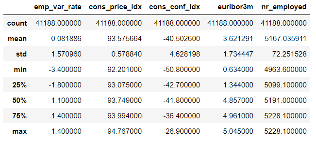

We also can look at how the records are distributed for the categorical variables: 

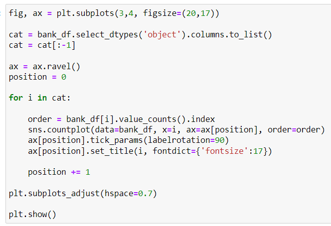

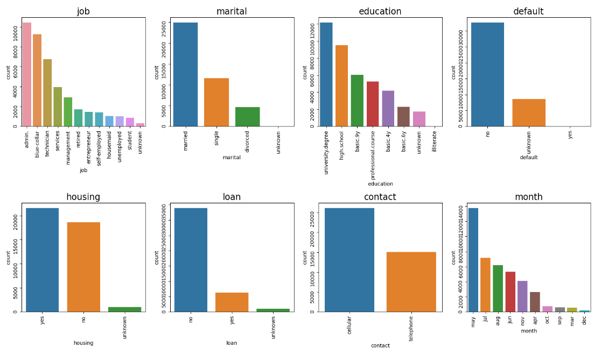

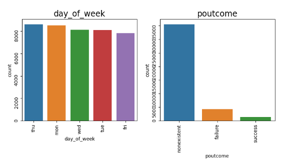

Finally, for some of the numerical variables, we will attempt to fit a curve to the distribution.  

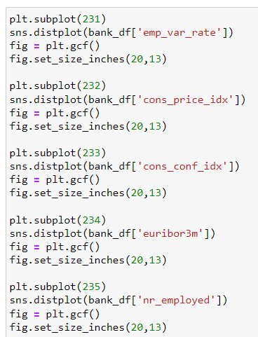

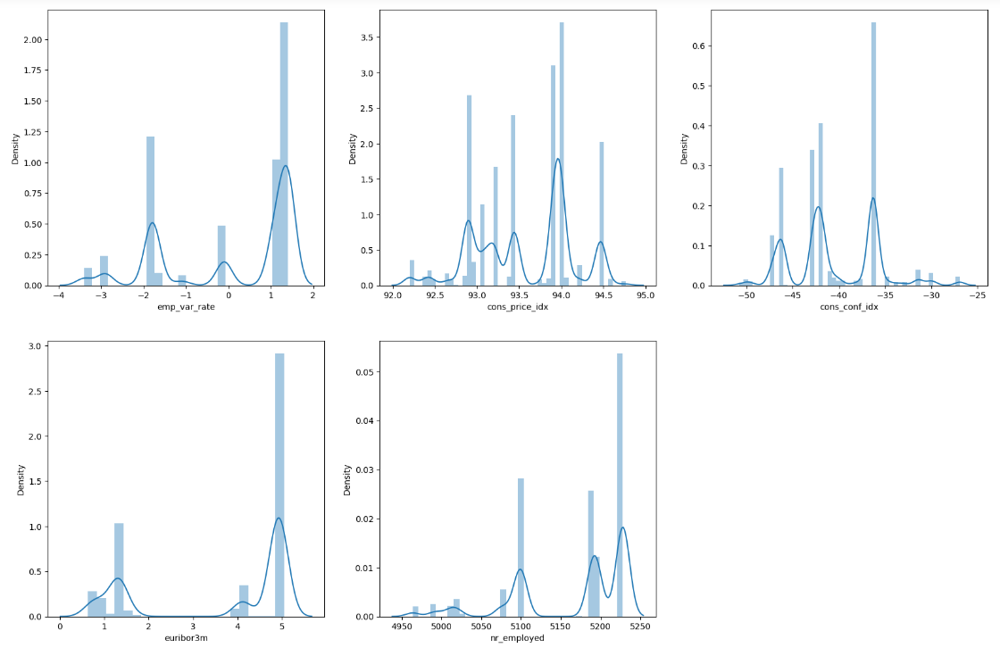

From these graphs, we can see that the numerical variables are not normally distributed. However, the analytical methods that we will be using will not be affected by this, so we are free to move on to the next step. 

After univariate analysis, we will conduct some bivariate analysis to look at the interactions between some multiple variables. First, we will examine how the response variable changes between various values of job and duration: 

From these graphs, we can see that the numerical variables are not normally distributed, but the analytical methods that we will be using will not be affected by this. 

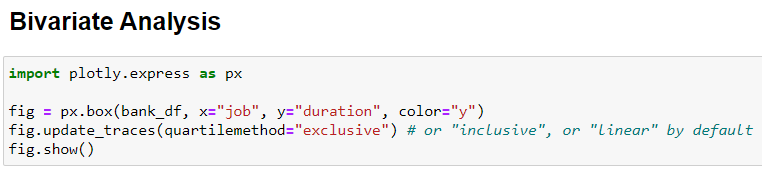

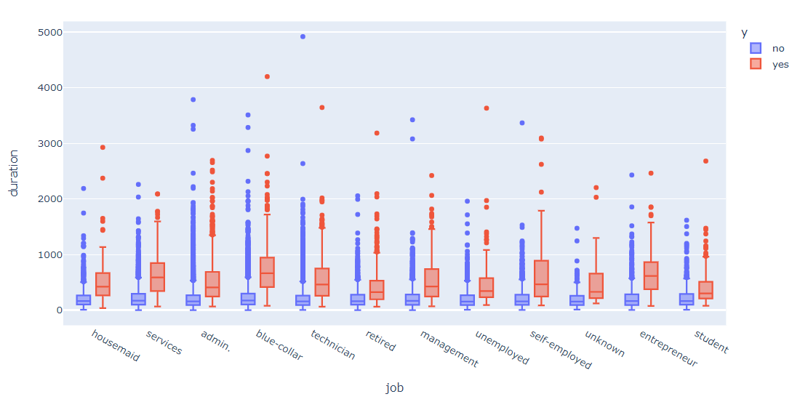

We also will look at how the response variable changes for different values of duration throughout the campaign: 

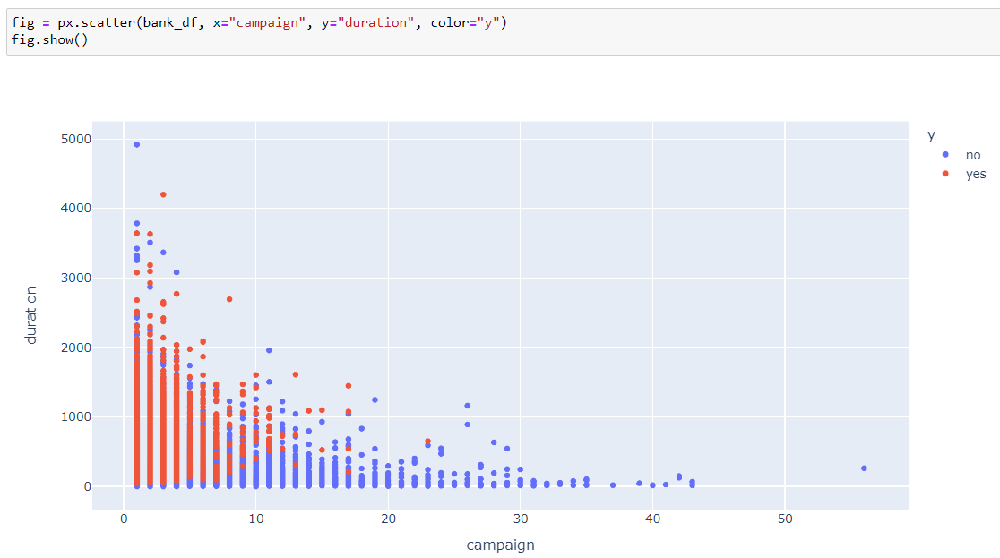

We can see that calls with a higher duration were more likely to result in a response of yes and a deposit being made. Also, we see that more of these long calls were made early on in the campaign, and more successful calls were also made early in the campaign. 

In addition, we can see how the values of the campaign variable are distributed across different months: 

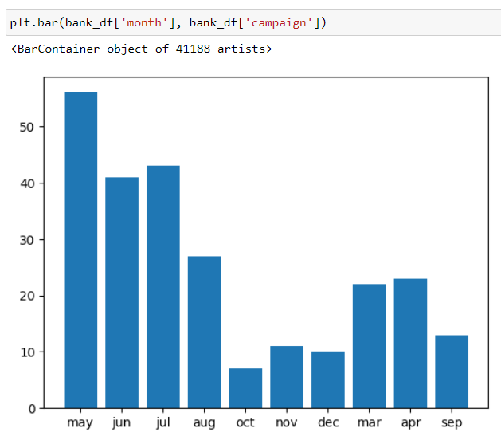

Here, we can see that much of the campaign was occurred in May, June, and July. We can interpret that these summer months bear less of a financial burden, so customers are more willing to deposit spare funds that they have during this time. 

Finally, we will look at how marital status affects the cons_price_index variable: 

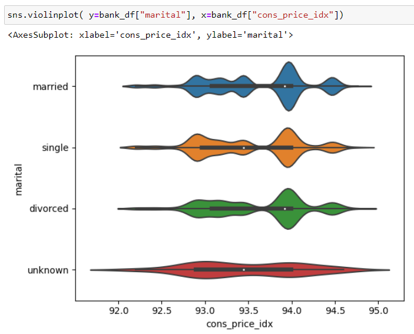

We see that those who are married have the highest average cons_price_index. These individuals likely have a higher CPI because they are more likely to be purchasing goods for a spouse and children than customers of other marital statuses.  

After conducting these univariate and bivariate analyses, we moved on to more advanced analytical methods. First, we conducted K-Means clustering with 2 clusters to group the observations into “yes” and “no” groups. We also performed five different supervised learning methods: Logistic Regression, Decision Tree, Random Forest, Gradient-Boosted Tree, and Linear SVM. We found that the Logistic Regression, Gradient-Boosted Tree, and Linear SVM all performed well, but the best-performing model was the Gradient-Boosted Tree. The training and evaluation codes for these models can be seen in the included notebook. 

We attempted to export a file for this LSVM model, but we encountered errors relating to the pickling process. When attempting to use the “.save(path)” method, we encountered an error stating that “path should be a string, got type %s”

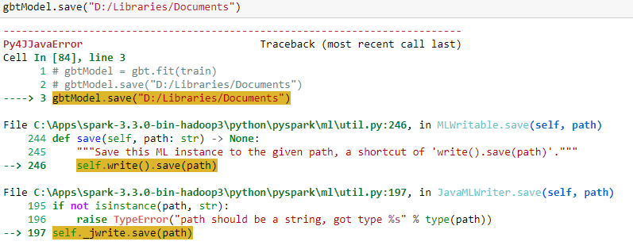

 

We attempted to use the “.save(sparkContext,path)” method instead, but we encountered an error stating that “save() takes 2 positional arguments but 3 were given” 

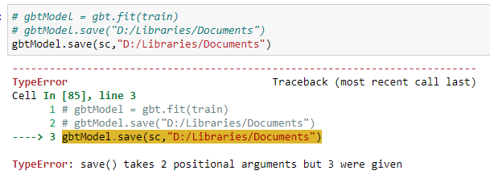

 

We also tried using the joblib library and pickle library, but both times we received errors that “cannot pickle ‘_thread.RLock’ object: 

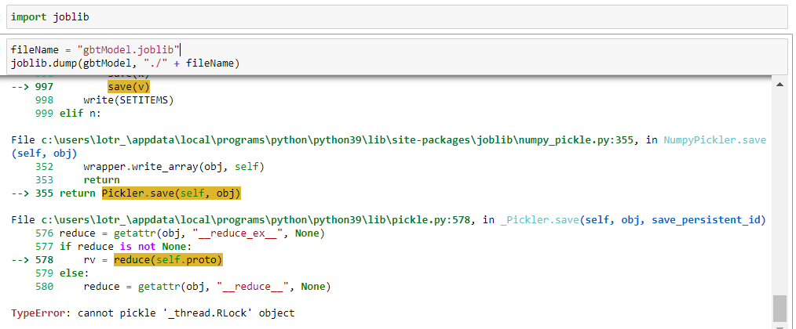

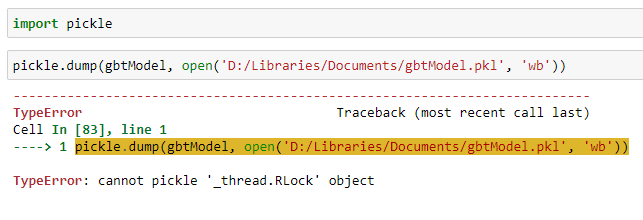

Because of these errors, we were unable to export a serialized file of our best model. However, the model should be able to be reproduced using the attached notebook.
