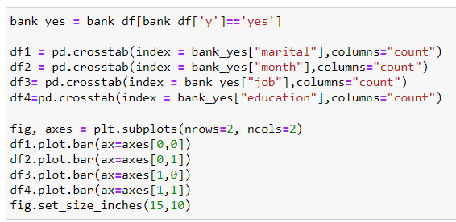

## Mini-Project-2
OKState BAN 5753 Mini-Project 2: Pyspark MLlib

We begin by importing the necessary libraries, initiating a Spark session, and reading in the data. Here, we can see what the data looks like: 

The first data preprocessing step is to rename all columns that contain a “.”, because this character will cause problems later. We will replace it with an underscore: 

Next, we will encode the Education column into a new integer column. Since levels of education have an implied order, we can provide additional meaning to this column by encoding it into an ordinal variable: 

After doing this, we will look at the various columns, based on their data type. First, we will look at the categorical/string columns: 

We also will examine the numerical columns and their statistics: 

 

After this step, we check for null or missing values in any columns. We can see that there are no null values: 

We also can check for imbalance between the two classes in the outcome variable, “y”. We see some class imbalance, so we can adjust for this with oversampling if it becomes and issue when we are training and evaluating our models.  

We also can visualize this class imbalance. For many of the visualizations in this report, we will need to convert the PySpark dataframe to Pandas in order to use the Pandas visualization functions, as seen below: 

The final step for us to check before we begin more detailed analysis is for correlation between predictor variables. If several predictors are highly correlated, then we can exclude some of them from our analysis without loosing explanation power. Below, our correlation analysis can be seen: 

